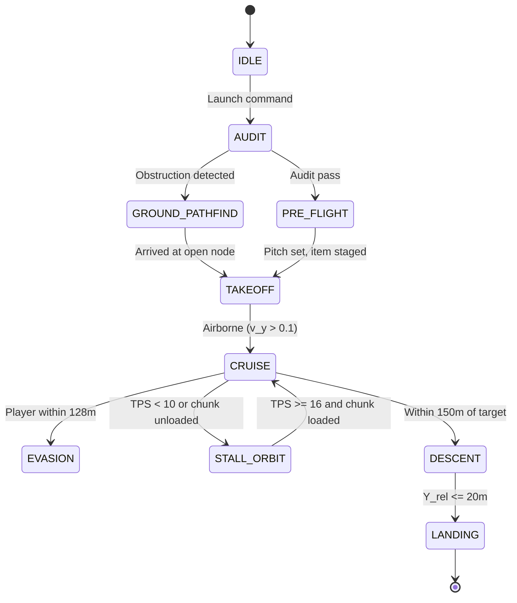

# EAFE — Autonomous Elytra Flight Engine

> Protocol-level navigation for autonomous flight in Minecraft

## Overview

EAFE (Autonomous Elytra Flight Engine) is a protocol-level navigation architecture for long-range autonomous elytra flight in Minecraft. It handles adaptive obstacle avoidance, threat evasion, and precision landing using vanilla physics compliance.

| Version | Status | Key Additions |
|---------|--------|---------------|
| v7.0 | Reference | FSM, kinematics, anti-cheat, Nether hazards |
| v7.1 | Current | Decompiled vanilla physics, axis-decoupled drag, 150ms jump apex, chunk hysteresis |

## Finite State Machine

## Core Physics

EAFE models Minecraft's discrete per-tick velocity update (1 tick = 50ms).

### Velocity Update Loop (v7.1 — Authoritative)

**Step 1: Pitch Energy Exchange**

Nose-UP ($\phi < 0$): Horizontal → vertical climbing:
$$\Delta v_y = v_h \cdot (-\sin\phi) \cdot 0.04$$

Nose-DOWN ($\phi > 0, v_y < 0$): Falling → horizontal thrust:
$$\Delta v_x = \frac{v_x}{v_h} \cdot (-v_y) \cdot \cos^2\phi \cdot 0.1$$

**Step 2: Gravity & Lift**
$$v_y' = v_y + \Delta v_y - 0.08 + (\cos^2\phi \cdot 0.06) + a_{boost,y}$$

**Step 3: Axis-Decoupled Drag**
$$v_{x,t+1} = v_x' \cdot 0.99 \quad \text{(horizontal)}$$
$$v_{y,t+1} = v_y' \cdot 0.98 \quad \text{(vertical)}$$

> **Key difference:** v7 used unified 0.99 drag. v7.1 correctly splits horizontal (0.99) and vertical (0.98), matching vanilla decompiled code.

### Version Comparison: Physics Model

| Aspect | v7.0 | v7.1 |
|--------|------|------|
| Drag | Unified $k_d = 0.99$ | Axis-decoupled: $D_h = 0.99$, $D_v = 0.98$ |
| Lift | $C_L = \cos\theta \cdot \min(1, \|\vec{v}\|^2)$ | Passive wing: $\cos^2\phi \cdot 0.06$ |
| Pitch exchange | Single formula | Decomposed nose-up (0.04) / nose-down (0.1) |
| Update order | Drag → gravity → lift | Pitch exchange → gravity+impulse+lift → drag |
| Nether hazard | Weighted sum $H(n)$ | Percentage ratio $H > 30\%$ |

## Navigation

### Target Angle Calculation
$$d_{2D} = \sqrt{(x_t - x_b)^2 + (z_t - z_b)^2}$$
$$\theta_{yaw} = \text{atan2}(-(x_t - x_b), z_t - z_b)$$
$$\phi_{pitch} = \text{atan2}(y_t - y_b, d_{2D})$$

### Fuel Requirement
$$N_{rockets} = \left\lceil \frac{d_{2D}}{68.5} \right\rceil + \left\lceil \frac{|Y_{cruise} - Y_{start}|}{28.0} \right\rceil + 15$$

## Anti-Cheat

Look-vector changes use cubic Bézier curves with Gaussian noise:
$$\vec{B}(t) = (1-t)^3 \vec{P}_0 + 3(1-t)^2 t \vec{P}_1 + 3(1-t) t^2 \vec{P}_2 + t^3 \vec{P}_3$$

Slew rate limits: $|\Delta\phi| \le 0.35$ rad/tick, $|\Delta\theta| \le 0.26$ rad/tick

## Landing

Archimedean spiral scan for safe landing zones:
$$r(\alpha) = a + b \cdot \alpha, \quad x = r\cos\alpha, \quad z = r\sin\alpha$$

Surface classifier: SAFE (grass/stone) → MODERATE (ice/slime) → FATAL (lava/void)

## Fail-Safe Matrix

| Error | Trigger | Recovery | Fallback |
|-------|---------|----------|----------|
| ERR_WALL_COLLISION | v_h < 0.1 while θ ≤ 0 | Pitch -0.70 rad + rocket + 180° yaw | GROUND_PATHFIND |
| ERR_ELYTRA_BREAK | Durability ≤ 10 | Equip totem, pitch +0.5 rad glide | LANDING (Dead-Stick) |
| ERR_CRITICAL_HEALTH | HP ≤ 6.0 | Totem swap, stratospheric boost | EVASION |
| ERR_CHUNK_FREEZE | Chunk unloaded | Pitch +0.05 rad, 30m orbit | STALL_ORBIT |
| ERR_RUBBERBAND_LOOP | 3 teleports in 10 ticks | Zero velocity, halve target speed | STALL_ORBIT |
| ERR_NO_FIREWORKS | Rocket count == 0 | Archimedean scan, dead-stick glide | DESCENT → LANDING |
| ERR_NETHER_BEDROCK | Y ≥ 118 or Y ≤ 35 | Pitch correction +0.3/-0.3 rad | Rocket thrust away |
| ERR_PORTAL_BLOCKAGE | No dimension shift in 60 ticks | Step back 3m, re-align, re-enter | GROUND_PATHFIND |

## Full Specifications

- [EAFE-v7.0 — Master Architecture](EAFE-v7.md)
- [EAFE-v7.1 — Engineering Specification](EAFE-v7.1.md)
- [Technical Audit](AUDIT.md)
