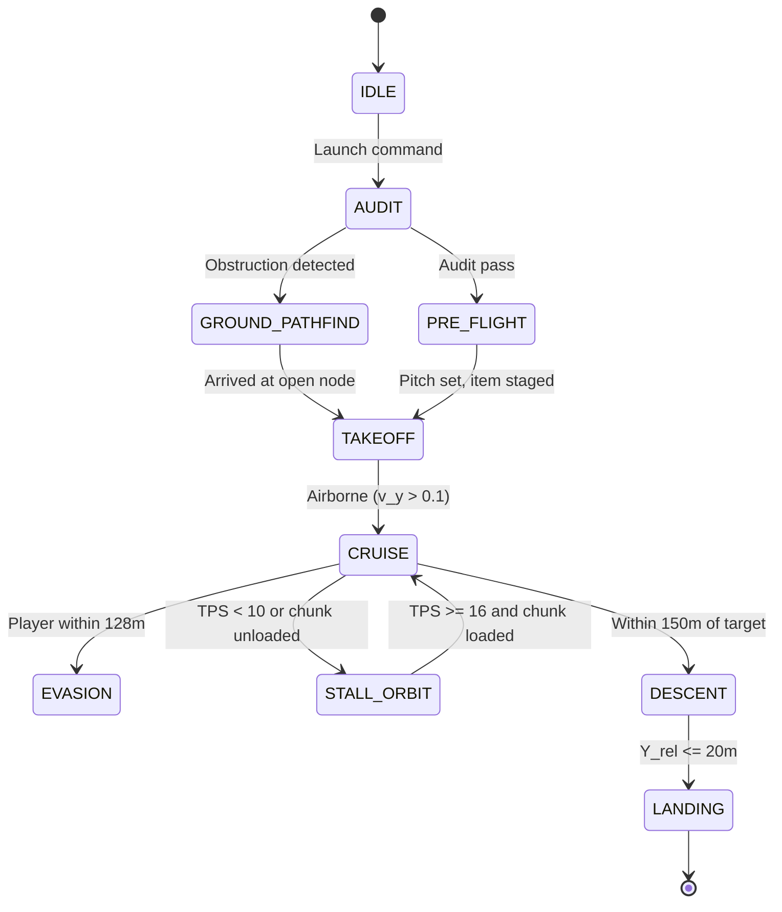

# EAFE Documentation Suite — Implementation Plan

> **For agentic workers:** REQUIRED SUB-SKILL: Use superpowers:subagent-driven-development (recommended) or superpowers:executing-plans to implement this plan task-by-task. Steps use checkbox (`- [ ]`) syntax for tracking.

**Goal:** Create AUDIT.md, README.md, and eafe-specs.html for the EAFE-v7/v7.1 autonomous elytra flight engine specs.

**Architecture:** Three deliverables built sequentially: (1) technical audit of both specs, (2) detailed README with inline formulas and Mermaid diagrams, (3) single-file HTML renderer with KaTeX and dark/light theme. Each file is self-contained with no build step.

**Tech Stack:** Markdown (GitHub-flavored), KaTeX v0.16 (CDN), Mermaid.js v10 (CDN), vanilla HTML/CSS/JS

## Global Constraints

- Existing files `EAFE-v7.md` and `EAFE-v7.1.md` are NOT modified
- All LaTeX must compile with KaTeX auto-render (delimiters: `$...$` inline, `$$...$$` display)
- HTML must work in Chrome, Firefox, Safari, Edge without build step
- Math notation: φ for pitch, ψ for yaw (matching v7.1 convention)
- Audit findings use format: ID, Severity, Location (file:line), Description, Recommendation

---

## File Structure

```
efly/
├── EAFE-v7.md          # Existing (unchanged)
├── EAFE-v7.1.md        # Existing (unchanged)
├── AUDIT.md            # Task 1 — Full technical audit
├── README.md           # Task 2 — Project overview
└── eafe-specs.html     # Task 3 — Interactive HTML renderer
```

---

### Task 1: AUDIT.md — Full Technical Audit

**Files:**
- Create: `AUDIT.md`

**Interfaces:**
- Consumes: `EAFE-v7.md` (267 lines), `EAFE-v7.1.md` (164 lines)
- Produces: Structured audit findings referenced by README.md

- [ ] **Step 1: Audit physics correctness**

Read both spec files. For each physics formula, verify against known vanilla Minecraft mechanics:
- Gravity: 0.08 blocks/tick² (correct per decompiled `LivingEntity.travel`)
- Horizontal drag: 0.99 (correct)
- Vertical drag: v7 uses 0.99 (wrong), v7.1 uses 0.98 (correct per decompilation)
- Passive wing lift: cos²φ × 0.06 (v7.1 only, matches vanilla)
- v7 `C_L = cos(θ) × min(1.0, ||v||² / 1.0)` — no physical basis, superseded by v7.1

Write findings as:
```
### PHYS-001: Unified drag constant in v7 is incorrect
- **Severity:** HIGH
- **Location:** EAFE-v7.md:59-67
- **Description:** v7 applies k_d = 0.99 uniformly to all axes. Vanilla uses 0.99 horizontal, 0.98 vertical. This causes vertical position drift over long distances.
- **Recommendation:** Document that v7.1 supersedes v7's drag model. Add note in v7 or leave as-is if v7 is reference-only.
```

- [ ] **Step 2: Audit formula consistency between versions**

Cross-check every formula that appears in both v7 and v7.1:
- Drag model (v7 unified 0.99 vs v7.1 axis-decoupled 0.99/0.98) — CONTRADICTION
- Lift model (v7 `C_L` formula vs v7.1 `cos²φ × 0.06`) — v7.1 supersedes
- Gravity (both use 0.08) — CONSISTENT
- Velocity update order (v7: drag first then gravity; v7.1: pitch exchange then gravity then drag) — DIFFERENT ORDER

Write findings as:
```
### CONSIST-001: Velocity update ordering differs
- **Severity:** MEDIUM
- **Location:** EAFE-v7.md:59-67, EAFE-v7.1.md:5-21
- **Description:** v7 applies drag before gravity; v7.1 applies pitch exchange, then gravity, then drag. These produce different numerical results.
- **Recommendation:** Note in README that v7.1 is the authoritative physics model.
```

- [ ] **Step 3: Audit FSM completeness**

For each state machine (v7 has 10 states, v7.1 has 7 states):
- Verify every state has at least one exit condition
- Verify every transition has a guard condition
- Flag RECOVERY state in v7.1 (line 152) with blank next-state
- Check for unreachable states (states with no incoming transitions)
- Verify IDLE is reachable from all terminal states

Write findings as:
```
### FSM-001: RECOVERY state has no defined next-state
- **Severity:** MEDIUM
- **Location:** EAFE-v7.1.md:152
- **Description:** RECOVERY row shows empty Next State column. Should specify: Flight restored → CRUISE; Ground reached → TAKEOFF.
- **Recommendation:** Fill in explicit transitions.
```

- [ ] **Step 4: Audit anti-cheat logic**

Review Section 4 of v7:
- Bézier control points: P1, P2 use `N(0, σ²)` with σ = 0.03 rad — no PRNG specified
- Slew rate: |Δφ| ≤ 0.35 rad/tick, |Δθ| ≤ 0.26 rad/tick — verify against human neck muscle limits
- Packet jitter: 50ms ± U(-4ms, +6ms) — asymmetric, verify intentional

Write findings as:
```
### ANTI-001: PRNG for Bézier perturbation unspecified
- **Severity:** LOW
- **Location:** EAFE-v7.md:121-122
- **Description:** Gaussian noise N(0, σ²) generation method not specified. Different PRNGs produce different sequences.
- **Recommendation:** Specify PRNG (e.g., seeded MT19937 or crypto.getRandomValues) and seed strategy.
```

- [ ] **Step 5: Audit edge cases and missing failure modes**

Review fail-safe matrices in both versions:
- Nether hazard weight w_4 = 200.0 for void — disproportionate (void is binary kill)
- Fuel formula `+15` safety buffer — undocumented empirical constant
- Portal blockage timeout 60 ticks (3s) — verify against vanilla portal cooldown (80 tick cooldown in vanilla)
- TPS threshold 12.0 — most servers run 20 TPS, 12 is quite low; verify this is the right cutoff
- v7 fail-safe ERR_RUBBERBAND_LOOP: "3 position resets in 10 ticks" — verify this threshold

Write findings as:
```
### EDGE-001: Nether void weight disproportionate
- **Severity:** LOW
- **Location:** EAFE-v7.md:220
- **Description:** w_4 = 200.0 for void indicator. Since void is binary (instant death), the weight just needs to be >0 to trigger avoidance. 200 inflates H(n) unnecessarily.
- **Recommendation:** Reduce to w_4 = 1.0 or document that high weight ensures immediate path rerouting.
```

- [ ] **Step 6: Audit mathematical notation**

Check all LaTeX for:
- Notation consistency: v7 uses φ for pitch and φ for yaw (same symbol, different context) — ambiguous
- v7.1 uses φ for pitch, θ for yaw — different convention from v7
- Verify all formulas are dimensionally consistent
- Flag any formula with unclear variable definitions

Write findings as:
```
### NOTATION-001: Pitch/yaw symbol convention differs between versions
- **Severity:** MEDIUM
- **Location:** EAFE-v7.md:56-57, EAFE-v7.1.md:39-40
- **Description:** v7 uses φ for both pitch and yaw (context-dependent). v7.1 uses φ for pitch and θ for yaw. Cross-referencing formulas between versions is confusing.
- **Recommendation:** Standardize on v7.1 convention (φ=pitch, θ=yaw) in README. Note the difference.
```

- [ ] **Step 7: Compile and format AUDIT.md**

Assemble all findings into a single document with:
- Executive summary (count by severity)
- Findings organized by category (Physics, Consistency, FSM, Anti-Cheat, Edge Cases, Notation)
- Each finding with ID, Severity, Location, Description, Recommendation
- Cross-reference table: which v7 issues are fixed in v7.1

- [ ] **Step 8: Verify audit completeness**

Re-read both specs and confirm every section has been reviewed:
- v7: Sections 1-9 (FSM, Kinematics, Pre-Flight, Anti-Cheat, Navigation, Threat Evasion, Nether, Landing, Fail-Safe)
- v7.1: Sections 1-7 (Physics, Navigation, Takeoff, Chunk Streaming, Nether, Landing, FSM/Fail-Safe)

Check that no section was skipped. Count findings per section.

- [ ] **Step 9: Commit**

```bash
git add AUDIT.md
git commit -m "docs: add full technical audit of EAFE-v7 and v7.1 specs"
```

---

### Task 2: README.md — Project Overview

**Files:**
- Create: `README.md`

**Interfaces:**
- Consumes: `EAFE-v7.md`, `EAFE-v7.1.md`, `AUDIT.md` (from Task 1)
- Produces: GitHub landing page with inline formulas, diagrams, and summary tables

- [ ] **Step 1: Write header and overview section**

```markdown
# EAFE — Autonomous Elytra Flight Engine

> Protocol-level navigation for autonomous flight in Minecraft

[](EAFE-v7.1.md)
[](EAFE-v7.md)
[](AUDIT.md)

## Overview

EAFE (Autonomous Elytra Flight Engine) is a protocol-level navigation architecture for long-range autonomous elytra flight in Minecraft. It handles adaptive obstacle avoidance, threat evasion, and precision landing using vanilla physics compliance.

| Version | Status | Key Additions |
|---------|--------|---------------|
| v7.0 | Reference | FSM, kinematics, anti-cheat, Nether hazards |
| v7.1 | Current | Decompiled vanilla physics, axis-decoupled drag, 150ms jump apex, chunk hysteresis |
```

- [ ] **Step 2: Write FSM state diagram section**

```markdown
## Finite State Machine


```

- [ ] **Step 3: Write core physics section with formulas**

```markdown
## Core Physics

EAFE models Minecraft's discrete per-tick velocity update (1 tick = 50ms).

### Velocity Update Loop (v7.1 — Authoritative)

**Step 1: Pitch Energy Exchange**

Nose-UP (φ < 0): Horizontal → vertical climbing:
$$\Delta v_y = v_h \cdot (-\sin\phi) \cdot 0.04$$

Nose-DOWN (φ > 0, v_y < 0): Falling → horizontal thrust:
$$\Delta v_x = \frac{v_x}{v_h} \cdot (-v_y) \cdot \cos^2\phi \cdot 0.1$$

**Step 2: Gravity & Lift**
$$v_y' = v_y + \Delta v_y - 0.08 + (\cos^2\phi \cdot 0.06) + a_{boost,y}$$

**Step 3: Axis-Decoupled Drag**
$$v_{x,t+1} = v_x' \cdot 0.99 \quad \text{(horizontal)}$$
$$v_{y,t+1} = v_y' \cdot 0.98 \quad \text{(vertical)}$$

> **Key difference:** v7 used unified 0.99 drag. v7.1 correctly splits horizontal (0.99) and vertical (0.98), matching vanilla decompiled code.
```

- [ ] **Step 4: Write navigation, anti-cheat, and landing sections**

```markdown
## Navigation

### Target Angle Calculation
$$d_{2D} = \sqrt{(x_t - x_b)^2 + (z_t - z_b)^2}$$
$$\theta_{yaw} = \text{atan2}(-(x_t - x_b), z_t - z_b)$$
$$\phi_{pitch} = \text{atan2}(y_t - y_b, d_{2D})$$

### Fuel Requirement
$$N_{rockets} = \left\lceil \frac{d_{2D}}{68.5} \right\rceil + \left\lceil \frac{|Y_{cruise} - Y_{start}|}{28.0} \right\rceil + 15$$

## Anti-Ceat

Look-vector changes use cubic Bézier curves with Gaussian noise:
$$\vec{B}(t) = (1-t)^3 \vec{P}_0 + 3(1-t)^2 t \vec{P}_1 + 3(1-t) t^2 \vec{P}_2 + t^3 \vec{P}_3$$

Slew rate limits: |Δφ| ≤ 0.35 rad/tick, |Δθ| ≤ 0.26 rad/tick

## Landing

Archimedean spiral scan for safe landing zones:
$$r(\alpha) = a + b \cdot \alpha, \quad x = r\cos\alpha, \quad z = r\sin\alpha$$

Surface classifier: SAFE (grass/stone) → MODERATE (ice/slime) → FATAL (lava/void)
```

- [ ] **Step 5: Write fail-safe matrix table**

```markdown
## Fail-Safe Matrix

| Error | Trigger | Recovery | Fallback |
|-------|---------|----------|----------|
| ERR_WALL_COLLISION | v_h < 0.1 while θ ≤ 0 | Pitch -0.70 rad + rocket + 180° yaw | GROUND_PATHFIND |
| ERR_ELYTRA_BREAK | Durability ≤ 10 | Equip totem, pitch +0.5 rad glide | LANDING (Dead-Stick) |
| ERR_CRITICAL_HEALTH | HP ≤ 6.0 | Totem swap, stratospheric boost | EVASION |
| ERR_CHUNK_FREEZE | Chunk unloaded | Pitch +0.05 rad, 30m orbit | STALL_ORBIT |
| ERR_RUBBERBAND_LOOP | 3 teleports in 10 ticks | Zero velocity, halve target speed | STALL_ORBIT |
| ERR_NO_FIREWORKS | Rocket count == 0 | Archimedean scan, dead-stick glide | DESCENT → LANDING |
| ERR_NETHER_BEDROCK | Y ≥ 118 or Y ≤ 35 | Pitch correction +0.3/-0.3 rad | Rocket thrust away |
| ERR_PORTAL_BLOCKAGE | No dimension shift in 60 ticks | Step back 3m, re-align, re-enter | GROUND_PATHFIND |
```

- [ ] **Step 6: Write links section and commit**

```markdown
## Full Specifications

- [EAFE-v7.0 — Master Architecture](EAFE-v7.md)
- [EAFE-v7.1 — Engineering Specification](EAFE-v7.1.md)
- [Technical Audit](AUDIT.md)
```

```bash
git add README.md
git commit -m "docs: add detailed README with inline formulas and diagrams"
```

---

### Task 3: eafe-specs.html — Interactive HTML Renderer

**Files:**
- Create: `eafe-specs.html`

**Interfaces:**
- Consumes: `EAFE-v7.md`, `EAFE-v7.1.md`, `AUDIT.md` (embedded as JS strings or fetched)
- Produces: Single self-contained HTML file with KaTeX, Mermaid, dark/light theme

- [ ] **Step 1: Create HTML skeleton with CDN dependencies**

```html
<!DOCTYPE html>
<html lang="en" data-theme="dark">
<head>
    <meta charset="UTF-8">
    <meta name="viewport" content="width=device-width, initial-scale=1.0">
    <title>EAFE Specs</title>
    <link rel="stylesheet" href="https://cdn.jsdelivr.net/npm/katex@0.16.11/dist/katex.min.css">
    <script defer src="https://cdn.jsdelivr.net/npm/katex@0.16.11/dist/katex.min.js"></script>
    <script defer src="https://cdn.jsdelivr.net/npm/katex@0.16.11/dist/contrib/auto-render.min.js"></script>
    <script src="https://cdn.jsdelivr.net/npm/mermaid@10.9.1/dist/mermaid.min.js"></script>
    <style>/* CSS here */</style>
</head>
<body>
    <header><!-- tabs + theme toggle --></header>
    <aside><!-- sidebar TOC --></aside>
    <main><!-- content --></main>
    <script>/* JS here */</script>
</body>
</html>
```

- [ ] **Step 2: Write CSS with dark/light theme**

```css
:root {
    --bg: #1a1a2e;
    --text: #e0e0e0;
    --border: #333;
    --accent: #4fc3f7;
    --code-bg: #0d1117;
    --table-stripe: #16213e;
}
[data-theme="light"] {
    --bg: #ffffff;
    --text: #1a1a1a;
    --border: #ddd;
    --accent: #1976d2;
    --code-bg: #f5f5f5;
    --table-stripe: #f9f9f9;
}
body { font-family: system-ui, sans-serif; background: var(--bg); color: var(--text); }
```

Style sidebar, tabs, tables, code blocks, collapsible sections, responsive breakpoints.

- [ ] **Step 3: Embed spec content as JS strings**

Create a `SPECS` object containing the raw markdown of each file:
```javascript
const SPECS = {
    v7: `# EAFE-v7 Master Architecture Specification\n...`,
    v71: `# EAFE-v7.1 Engineering Specification\n...`,
    audit: `# EAFE Technical Audit\n...`
};
```

Parse markdown to HTML using a lightweight parser (or embed pre-rendered HTML).

- [ ] **Step 4: Implement markdown-to-HTML rendering**

Use a minimal markdown parser (or write one — headings, tables, lists, code blocks, bold/italic). No heavy libraries. Handle:
- `#` headings → `<h1>`-`<h6>`
- Tables → `<table>` with striped rows
- Code blocks → `<pre><code>` with syntax highlighting via CSS
- `$...$` → left for KaTeX auto-render
- `**bold**` → `<strong>`, `*italic*` → `<em>`
- Lists → `<ul>`, `<ol>`

- [ ] **Step 5: Implement tab switching and TOC generation**

```javascript
function switchTab(tab) {
    document.querySelectorAll('.tab').forEach(t => t.classList.remove('active'));
    document.querySelector(`[data-tab="${tab}"]`).classList.add('active');
    renderContent(SPECS[tab]);
    generateTOC();
}
```

TOC: scan rendered HTML for `h2`, `h3` elements, build nested list with anchor links.

- [ ] **Step 6: Implement dark/light theme toggle**

```javascript
const toggle = document.getElementById('theme-toggle');
toggle.addEventListener('click', () => {
    const html = document.documentElement;
    const next = html.dataset.theme === 'dark' ? 'light' : 'dark';
    html.dataset.theme = next;
    localStorage.setItem('eafe-theme', next);
});
// Restore on load
const saved = localStorage.getItem('eafe-theme');
if (saved) document.documentElement.dataset.theme = saved;
```

- [ ] **Step 7: Initialize KaTeX and Mermaid after content render**

```javascript
document.addEventListener('DOMContentLoaded', () => {
    mermaid.initialize({ startOnLoad: false, theme: 'dark' });
    renderContent(SPECS.v7);
    // After DOM update:
    renderMathInElement(document.body, {
        delimiters: [
            { left: '$$', right: '$$', display: true },
            { left: '$', right: '$', display: false }
        ]
    });
    mermaid.run();
});
```

- [ ] **Step 8: Add responsive sidebar collapse**

```css
@media (max-width: 768px) {
    aside { display: none; }
    aside.open { display: block; position: fixed; z-index: 100; }
}
```

Hamburger button toggles sidebar on mobile.

- [ ] **Step 9: Test in browser and commit**

Open `eafe-specs.html` in browser. Verify:
- KaTeX renders all formulas
- Mermaid renders state diagrams
- Dark/light toggle works
- Tab switching between v7/v7.1/Audit works
- Sidebar TOC links scroll to correct sections
- Responsive on mobile viewport

```bash
git add eafe-specs.html
git commit -m "docs: add interactive HTML spec renderer with KaTeX and dark mode"
```

---

### Task 4: Final Verification

- [ ] **Step 1: Verify all LaTeX compiles**

Open HTML in browser, check console for KaTeX errors. All `$...$` and `$$...$$` blocks should render.

- [ ] **Step 2: Verify Mermaid diagrams render**

Check that FSM state diagram renders correctly in both README (GitHub) and HTML.

- [ ] **Step 3: Verify README renders on GitHub**

Push to GitHub and confirm README.md renders with inline LaTeX and Mermaid.

- [ ] **Step 4: Verify cross-references**

Click all links in README — they should point to existing files.

- [ ] **Step 5: Final commit**

```bash
git add -A
git commit -m "docs: EAFE documentation suite complete"
```
